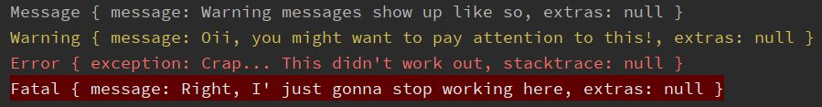

# colored_lumberdash

Plugin for [lumberdash](https://github.com/jorgecoca/lumberdash).

Prettier colors for your log messages on all major platforms. 

Difference between `colored_lumberdash` and `colorized_lumberdash` is that this package
uses `AnsiPen` to color output which _does color your text_, on win platform too. 



## How to use

Add `colored_lumberdash` to your dependencies. Then pass an instance of `ColoredLumberdash` to `lumberdash`:

```dart
import 'package:colorize_lumberdash/colorize_lumberdash.dart';
import 'package:lumberdash/lumberdash.dart';

void main() {
  putLumberdashToWork(withClient: ColorizeLumberdash());
  logWarning('Hello Warning');
  logFatal('Hello Fatal!');
  logMessage('Hello Message!');
  logError(Exception('Hello Error'));
}
```
